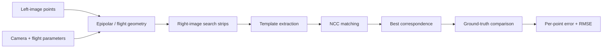
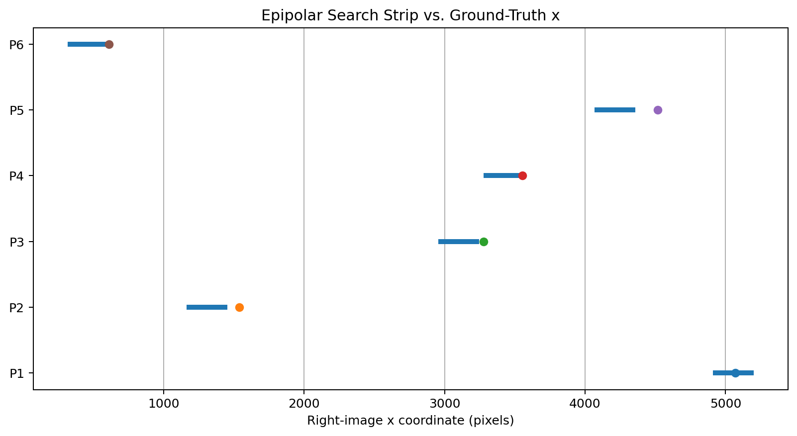
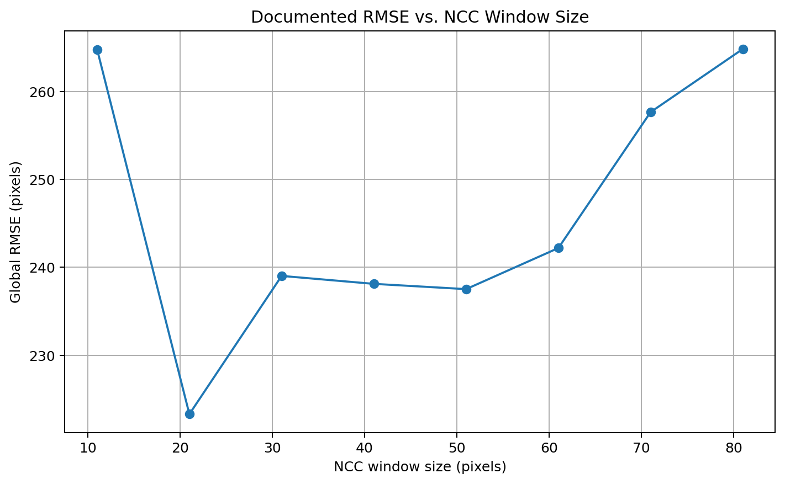

# Epipolar-Constrained NCC Stereo Matching

A reproducible Python project for **area-based stereo image matching** in aerial photogrammetry using:

- a geometry-derived epipolar search strip
- normalized cross-correlation (NCC)
- multiple template/window sizes
- ground-truth evaluation with RMSE

This repository originated from a graduate **Digital Photogrammetry** project at K. N. Toosi University of Technology.

## Problem

Image matching is a core step in photogrammetry and stereo vision. Correct correspondences are required for tasks such as:

- parallax measurement
- 3D reconstruction
- terrain/elevation modeling
- image orientation and georeferencing

The coursework compared corresponding points between two overlapping aerial images.

Instead of manually choosing a search region in the right image, this implementation estimates a horizontal search strip from the flight/camera geometry and searches for the best NCC match inside that region.

## Method Overview



## Coursework Geometry

The original experiment used:

| Parameter | Value |
|---|---:|
| Photo scale | 1:5000 |
| Focal length | 153.24 mm |
| Camera elevation | 2649.93 m |
| Average ground elevation | 1883.73 m |
| Photo base | 77.5 mm |
| Pixel size | 18 µm |
| Terrain-height uncertainty | 15 m |

The horizontal search strip is computed using the coursework equations:

```text
B = b / s

P_x = ((B * f) / (H - Zp)) / pixel_size

x_second = round(x_left - P_x)

S = (b * H * Delta_z) / (H - Zp)^2 / pixel_size

X_search = [x_second - floor(S/2), x_second + floor(S/2)]
```

For the six documented points, this reproduces:

| Point | x-min | x-max |
|---|---:|---:|
| P1 | 4911 | 5201 |
| P2 | 1163 | 1453 |
| P3 | 2956 | 3246 |
| P4 | 3278 | 3568 |
| P5 | 4067 | 4357 |
| P6 | 315 | 605 |

## Important Diagnostic Finding

Comparing the geometry-derived search strips with the manually measured right-image ground truth shows that only **2 of 6** ground-truth x coordinates fall inside the predicted strip:

| Point | GT x | Inside strip? |
|---|---:|:---:|
| P1 | 5071 | Yes |
| P2 | 1539 | No |
| P3 | 3278 | No |
| P4 | 3552 | Yes |
| P5 | 4516 | No |
| P6 | 610 | No |

This explains a key behavior in the documented results: some points can match very accurately, while others cannot reach their true correspondence because the search model does not cover it.



This is an important engineering lesson: **geometric constraints can accelerate and automate matching, but the uncertainty model must be wide/accurate enough to contain the real correspondence.**

## NCC Matching

The matching criterion is zero-mean normalized cross-correlation.

The original coursework implemented NCC explicitly with a sliding window. The public refactor keeps the same criterion but uses OpenCV's optimized `TM_CCOEFF_NORMED` implementation for faster search.

The best positive correlation is accepted only when:

```text
max_NCC >= threshold
```

The default threshold remains:

```text
0.4
```

## Window-Size Experiment

The documented experiment evaluated:

```text
11x11, 21x21, 31x31, 41x41,
51x51, 61x61, 71x71, 81x81
```

The recorded global RMSE values were:

| Window | Global RMSE (px) | Valid Matches |
|---:|---:|---:|
| 11 | 264.795 | 6 |
| 21 | 223.301 | 6 |
| 31 | 239.028 | 5 |
| 41 | 238.124 | 5 |
| 51 | 237.525 | 5 |
| 61 | 242.201 | 5 |
| 71 | 257.668 | 4 |
| 81 | 264.851 | 4 |

For this documented experiment, the lowest global RMSE occurred at a **21x21** window.



A useful point-level example is P4:

- `21x21` window: approximately **1 px** error
- `31x31` window: approximately **2 px** error

This shows that NCC can perform very well when the search strip actually contains a distinctive true correspondence.

## Repository Structure

```text
epipolar-ncc-stereo-matching/
├── README.md
├── LICENSE
├── requirements.txt
├── .gitignore
├── src/
│   ├── __init__.py
│   └── stereo_matching.py
├── examples/
│   └── run_matching.py
├── tests/
│   ├── __init__.py
│   ├── test_geometry.py
│   └── test_ncc.py
├── data/
│   ├── left_points.csv
│   ├── right_ground_truth.csv
│   ├── documented_results.csv
│   └── documented_matches.csv
└── figures/
    ├── rmse_vs_window.png
    └── search_strip_coverage.png
```

## Installation

```bash
git clone https://github.com/Reza-pourali/epipolar-ncc-stereo-matching.git
cd epipolar-ncc-stereo-matching
pip install -r requirements.txt
```

## Run on the Original Stereo Pair

The original aerial images are **not included** in this repository.

If you have `1614.png` and `1615.png`, run:

```bash
python examples/run_matching.py 1614.png 1615.png
```

Custom points can also be supplied:

```bash
python examples/run_matching.py left.png right.png \
  --left-points data/left_points.csv \
  --ground-truth data/right_ground_truth.csv
```

The default window sizes are:

```text
11 21 31 41 51 61 71 81
```

## Testing

Run:

```bash
python -m unittest discover -s tests
```

The tests verify:

- reproduction of the documented epipolar search strips
- the 2/6 ground-truth coverage diagnostic
- NCC mathematical behavior
- a synthetic known-shift match
- RMSE evaluation

## Corrections Made Before Publication

The original coursework script was kept conceptually intact, but the public version fixes several implementation/presentation issues:

1. removed hard-coded Windows image paths;
2. made left/right image dimensions independent;
3. changed the NCC threshold condition from `abs(maxc)` to the physically relevant positive maximum correlation;
4. made the search-region visualization match the **actual** vertical search used by the matcher;
5. retained the executed coursework value of `y ± 100 px` and documents the report/code discrepancy instead of silently mixing them;
6. replaced the slow Python sliding-window loop with optimized OpenCV NCC while preserving the same matching criterion;
7. separated geometry, matching, evaluation, data, tests, and examples into reusable modules.

## Scope and Limitations

The original stereo images were not available when this repository was refactored, so the public package does **not** claim that the refactored matcher has been rerun on those exact images.

The `data/documented_results.csv` and `data/documented_matches.csv` files preserve the results produced by the submitted coursework run.

The geometry/search-strip equations are preserved from the coursework model. The large RMSE values are not hidden; they are analyzed as evidence that several true correspondences fall outside the geometry-derived search strips.

## Research Relevance

This project demonstrates hands-on experience with:

- photogrammetric stereo matching
- epipolar/geometric search constraints
- normalized cross-correlation
- template matching
- correspondence evaluation
- ground-truth error analysis
- RMSE
- computer vision with OpenCV
- reproducible scientific Python

It directly connects **photogrammetry** with **computer vision and stereo correspondence**.

## Academic Context

Graduate coursework in **Digital Photogrammetry**  
K. N. Toosi University of Technology

## Author

**Reza Pourali**  
M.Sc. Student in Photogrammetry  
K. N. Toosi University of Technology
